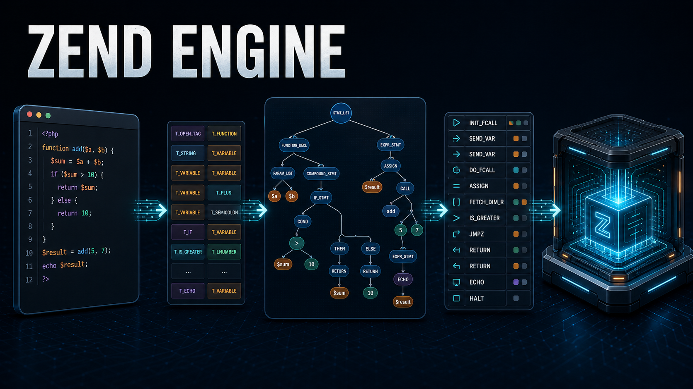
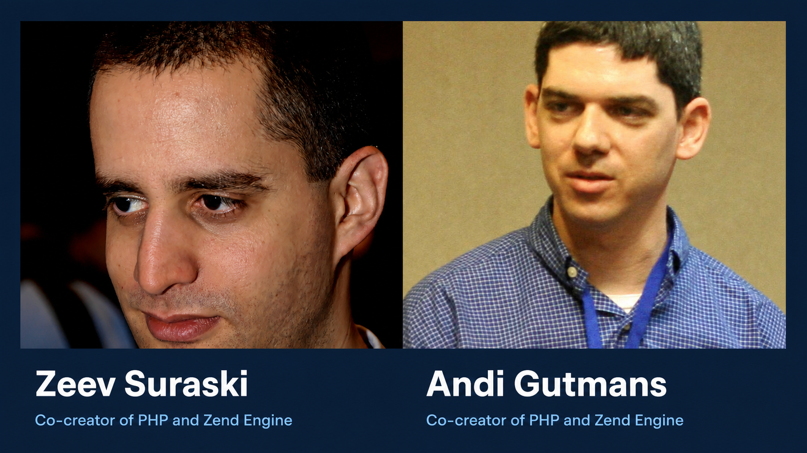
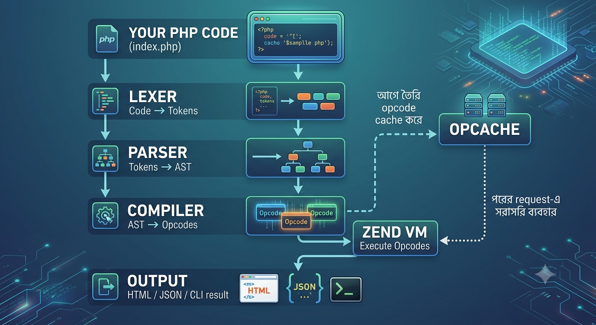

# What Is the Zend Engine? How PHP Code Actually Runs



Imagine writing a small PHP file:

```php
echo "Hello, World!";
```

You refresh the browser, and the result appears almost instantly. It feels ordinary. But between that line of code and the output on the screen, an important journey takes place.

Who understands what a variable, a function, an `if` statement, or a loop means? Who decides what should happen first and what should happen next?

Behind those invisible steps is the **Zend Engine**: the part of PHP that understands your code, turns it into something executable, and runs it.

## Zend Engine in One Sentence

**The Zend Engine is PHP's core execution engine.** It reads PHP code, understands its structure, creates executable instructions, and runs them.

Put simply, a `.php` file does not run by itself. The Zend Engine moves it through a series of stages until PHP can execute it and produce a result.

The name **Zend** comes from the names **Zeev Suraski** and **Andi Gutmans**: **"Ze"** from Zeev and **"nd"** from Andi. Both played important roles in the early development of PHP and in the creation of the Zend Engine.



*Zeev Suraski (left) and Andi Gutmans (right), associated with the creation of the Zend Engine.*

## Is PHP the Same as the Zend Engine?

No. The Zend Engine is PHP's most important internal component, but it is not the whole PHP platform.

```
PHP
├── Zend Engine       → Parses, compiles, and executes code
├── SAPI layer        → Connects PHP to the web server, CLI, and other environments
└── Extensions        → Add features such as PDO, cURL, mbstring, and GD
```

You can think of the Zend Engine as PHP's brain. It determines how code is understood and executed. Extensions handle specialised work such as database connectivity, image processing, and HTTP clients.

## What Happens Inside the Zend Engine?

From the moment a PHP script is loaded until it produces output, the Zend Engine moves through several important stages. The diagram below shows the journey at a high level.



*From PHP source code to Zend VM execution. OPcache can reuse compiled opcodes on later requests.*

### Step 1: Lexing or Tokenizing

At first, PHP code is just text. The Zend Lexer breaks that text into small meaningful pieces called **tokens**.

For example:

```php
$total = 5;
```

The engine can recognise it roughly like this:

```
[variable: $total] [operator: =] [number: 5] [semicolon: ;]
```

At this point, the engine is not executing the code. It is only identifying its words, symbols, and basic parts.

### Step 2: Parsing and Building an AST

Next, the parser examines the tokens and determines what they mean together.

For example, it can identify:

- Whether something is a variable assignment
- Where an `if` block begins and ends
- Which arguments belong to a function call
- Which expression must be evaluated first

The engine represents this structure as an **AST (Abstract Syntax Tree)**. An AST is like a structural map of your code.

PHP 7 introduced the AST as an intermediate step in compilation, separating the parser from the compiler and making the process easier to maintain and extend.

### Step 3: Compiling to Opcodes

The Zend Engine then turns the AST into **opcodes**, short for operation codes.

Opcodes are low-level instructions for the Zend VM. A simple assignment or function call may be represented by several opcodes.

That is why calling PHP only an "interpreted language" is not quite complete. PHP source code is generally compiled into opcodes first, and the Zend VM then executes those opcodes.

### Step 4: Execution by the Zend VM

Finally, the **Zend VM (Virtual Machine)** executes the opcodes one by one.

One opcode may store a value in a variable, another may call a function, and another may check a condition to decide which instruction comes next. This is how PHP eventually produces HTML in a browser, JSON from an API, or output in a terminal.

The complete journey looks like this:

```
PHP code → Tokens → AST → Opcodes → Zend VM → Output
```

## Why OPcache Matters

Without caching, PHP may need to load, parse, and compile the same source files repeatedly. That creates unnecessary CPU work.

**OPcache** reduces that work by storing precompiled script bytecode in shared memory. When the same file runs again, PHP can often reuse the cached opcodes instead of compiling the source from the beginning.

```
First request:
Code → Tokens → AST → Opcodes → Execute

Later request:
Cached opcodes → Execute
```

For this reason, OPcache is normally essential in production. It reduces compilation overhead and can improve response time, especially in larger applications.

OPcache is specifically an opcode cache. It is not a replacement for framework configuration caches, route caches, or application-data caches; those solve different problems.

## JIT: An Optimisation Added in PHP 8

PHP 8.0 introduced **JIT (Just-In-Time) compilation**.

Normally, the Zend VM interprets opcodes as it runs them. JIT can take selected hot code paths at runtime and compile them into native machine code, reducing some of the VM's interpretation overhead.

However, JIT is not equally useful for every PHP application.

It is more likely to help with CPU-intensive workloads such as:

- Complex mathematical or scientific calculations
- Image or signal processing
- Long-running computations
- Certain data-processing workloads

In a typical web application, the main bottleneck is often a database query, a network call, file I/O, or an external service. In those cases, enabling JIT does not guarantee a visible performance improvement.

The practical rule is simple: **benchmark your own workload before enabling JIT.**

## A Few Features That Show the Engine's Capabilities

The Zend Engine does more than execute code. PHP also maintains runtime state and internal metadata that make several powerful features possible.

- **Generators (`yield`)** can pause execution and later continue from the same point.
- **Fibers** can suspend and resume an execution context, enabling more advanced asynchronous patterns.
- **Reflection** lets you inspect classes, methods, properties, functions, and extensions at runtime.

These features may look separate, but they all depend on PHP being able to manage execution state and runtime information.

## Seeing PHP Differently

**The Zend Engine is PHP's core execution engine.** It turns your PHP code into tokens, an AST, and opcodes, then executes those opcodes through the Zend VM.

OPcache keeps compiled opcodes available for reuse and reduces repeated compilation work. JIT can go a step further for certain CPU-intensive workloads by generating native machine code.

Understanding the Zend Engine is not only about learning internals. It also helps you make better decisions about performance, debugging, and PHP runtime behaviour.

---

*Image attribution: Photo of Zeev Suraski by TheMissileSilo; photo of Andi Gutmans by Jim Winstead. Cropped and combined. Licensed under [CC BY 2.0](https://creativecommons.org/licenses/by/2.0/).*

## References & Sources

- [PHP Manual: OPcache](https://www.php.net/manual/en/book.opcache.php)
- [PHP RFC: Abstract Syntax Tree](https://wiki.php.net/rfc/abstract_syntax_tree)
- [PHP RFC: JIT](https://wiki.php.net/rfc/jit)
- [PHP Manual: Fibers](https://www.php.net/manual/en/language.fibers.php)
- [PHP Manual: Generators](https://www.php.net/manual/en/language.generators.overview.php)
- [PHP Manual: Reflection](https://www.php.net/reflection)